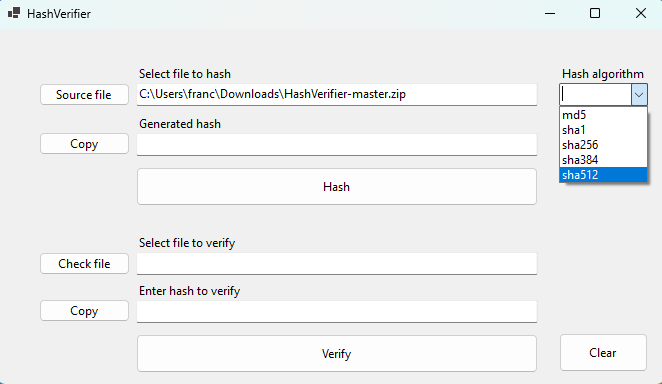

[🇪🇸 Español](docs/README-ESP.md) | [🇬🇧 English](README.md)
# 🛠️ HashVerifier
HashVerifier is a Windows Forms application in C# that allows you to calculate and verify file hashes using several hash algorithms, with an intuitive and functional interface. It is ideal for verifying file integrity and ensuring they have not been altered.


## 🚀 Description
HashVerifier allows you to calculate and verify file hashes using several algorithms: **MD5, SHA-1, SHA-256, SHA-384** and **SHA-512**.

## ✨ Features
- 📂 File selection to calculate its hash.
- 🔍 Selection of the hash algorithm.
- ✅ Verify if the calculated hash matches a given hash.
- 👤 Simple and easy-to-use graphical user interface.

## 🖥️ Requirements
- .NET Framework 4.7.2 or higher

## ⚙️ Installation
1. Clone the repository:
   ```bash
   git clone https://github.com/QUIENTRAEHIEL0/HashVerifier.git
   ```
2. Navigate to the project directory: 
   ```bash
   cd HashVerifier
   ```

### Build in Visual Studio
1. Open the project file (`HashVerifier.sln`) in Visual Studio.
2. Build the application by selecting **Build > Build Solution**.
3. Run the application from the Visual Studio environment or using the `.exe` file generated in the `bin` folder.

### Build from the command line (using .NET CLI)
1. Make sure you have the .NET SDK installed. You can check with: 
   ```bash
   dotnet --version
   ```
2. In the project directory, build the application with the following command: 
   ```bash
   dotnet build
   ```
3. To run the application after building it, use: 
   ```bash
   dotnet run --project HashVerifier
   ```
   Or, if you prefer to run it from the compiled file, navigate to the folder `bin/Debug/net472` (or `Release` if you built it with the release option) and execute the corresponding `.exe` file.

### 📋 Calculate a hash 
1. Select the file you want to hash using the **"Source file"** button.


2. Select the hash algorithm in the dropdown menu **"Hash algorithm"**.   

   
3. Click on **"Hash"** to calculate the hash of the selected file.


4. The calculated hash is displayed and copied to the clipboard.  


### 📋 Verify a hash
1. To verify a hash, select the source file (the file you want to calculate the hash from) with **"Check file"**.
 

2. To verify the hash, copy the hash into the `text box` (inside the red rectangle).
 

3. Select the hash algorithm in the dropdown menu **"Hash algorithm"**.


4. To complete the verification, click on **"Verify"** and the result will be displayed in a pop-up window.
- `Hash match` It means that the hashes match

- `Error: hashes do not match` It means that the hashes do not match


### 🗑️ Clear
- To clear the information, you can click the (`clear`) button.  


## 🤝 Contributing
Contributions are welcome. If you want to contribute, follow these steps:
1. Fork the repository.
2. Create a new branch (`git checkout -b feature/new-feature`).
3. Make the necessary changes and commit (`git commit -am 'Add new feature'`).
4. Push to the branch (`git push origin feature/new-feature`).
5. Open a Pull Request.

---

**Developed with ❤️ by [Francisco](https://github.com/FranciscoFdez05)**
