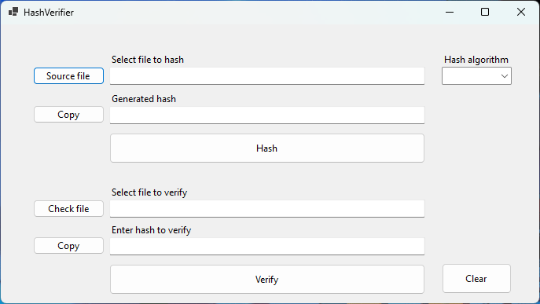
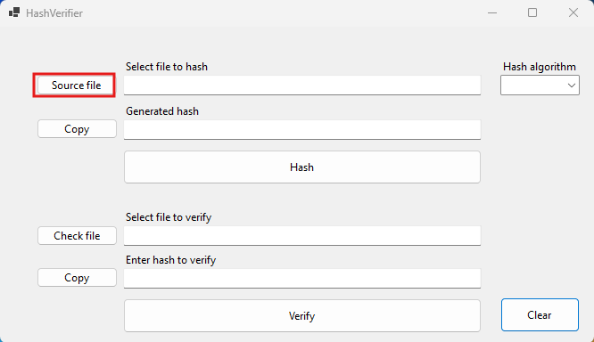
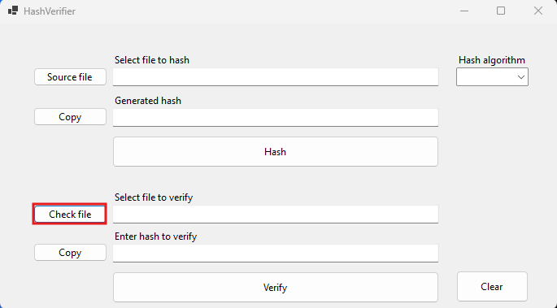
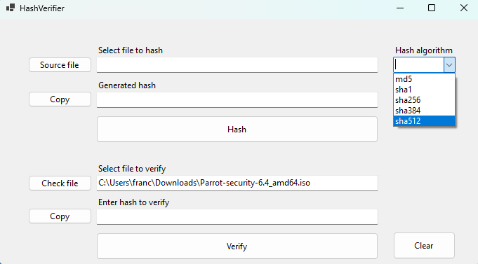

[🇪🇸 Español](docs/README-ES.md) | [🇬🇧 English](README.md)
# 🛠️ HashVerifier
HashVerifier is a Windows Forms application in C# that allows you to calculate and verify file hashes using various hash algorithms, with an intuitive and functional interface. It is ideal for verifying the integrity of files and ensuring that they have not been altered.

## 🚀 Description
HashVerifier allows you to calculate and verify file hashes using several algorithms: **MD5, SHA-1, SHA-224, SHA-256, SHA-384**, and **SHA-512**.

## ✨ Features
- 📂 Select a file to calculate its hash.
- 🔍 Choose the hash algorithm.
- 💾 Save the calculated hash to a file.
- ✅ Verify if the calculated hash matches a given hash.
- 👤 Simple and easy-to-use graphical user interface.

## 🖥️ Requirements
- .NET Framework 4.7.2 or higher

## ⚙️ Installation
1. Clone the repository: `git clone https://github.com/QUIENTRAEHIEL0/HashVerifier.git`
2. Navigate to the project directory: `cd HashVerifier`

### Build in Visual Studio
1. Open the project file (`HashVerifier.sln`) in Visual Studio.
2. Build the application by selecting **Build > Build Solution**.
3. Run the application from the Visual Studio environment or through the generated `.exe` file in the `bin` folder.

### Build from the command line (using .NET CLI)
1. Ensure you have the .NET SDK installed. You can verify it with: `dotnet --version`
2. In the project directory, build the application with the following command: `dotnet build`
3. To run the application after building it, use: `dotnet run --project HashVerifier` Or, if you prefer to run it from the compiled file, navigate to the `bin/Debug/net472` (or `Release` if you used the release build option) folder and run the corresponding `.exe` file.

### 📋 Calculate a hash
1. Select the file you want to hash using the **"File to Hash"** button.
   
2. Indicate the path where you want to save the hash using the **"Hash File"** button.
   
3. Select the hash algorithm from the dropdown menu **"Hash Algorithm"**.
   
4. Click on **"Hash"** to calculate the hash of the selected file.
   
5. The calculated hash is saved to the selected path.

### 📋 Verify a hash
1. To verify a hash, select the source file (the file you want to calculate the hash for) using the **"Source File"** button.
   
2. To verify the hash, you must save the actual hash in a `.txt` file and indicate it using the **"Hash File"** button.
   
3. Select the hash algorithm from the dropdown menu **"Hash Algorithm"**.
   
4. To complete the verification, click on **"Verify,"** and a result will be shown in a popup window.
   

## 🤝 Contributing
Contributions are welcome. If you wish to contribute, please follow these steps:
1. Fork the repository.
2. Create a new branch (`git checkout -b feature/new-feature`).
3. Make the necessary changes and commit (`git commit -am 'Add new feature'`).
4. Push to the branch (`git push origin feature/new-feature`).
5. Open a Pull Request.

---

**Developed with ❤️ by [Francisco](https://github.com/FranciscoFdez05)**
