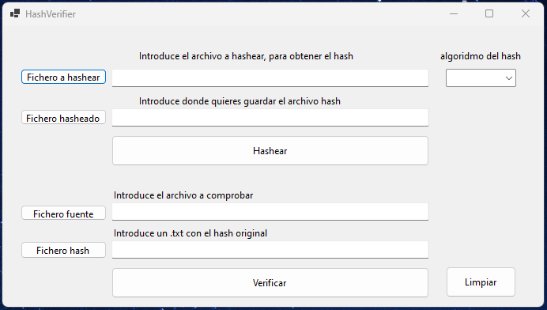
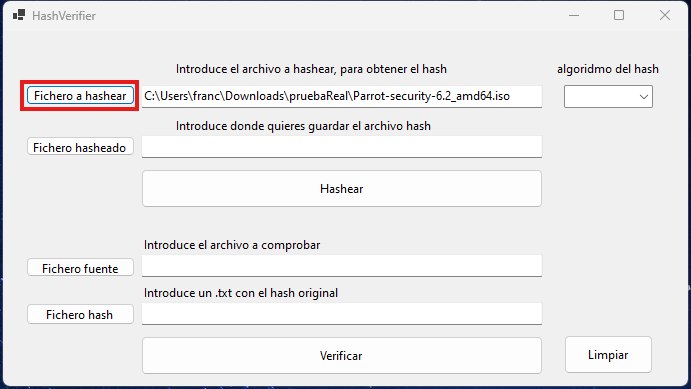
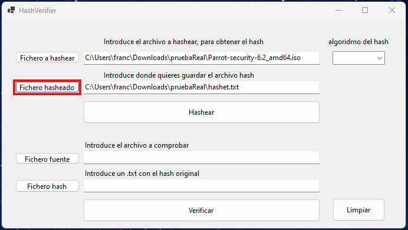
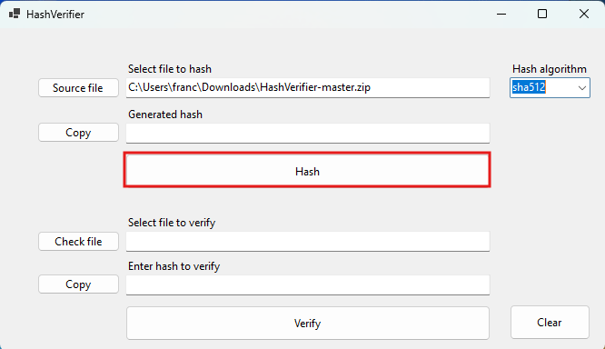
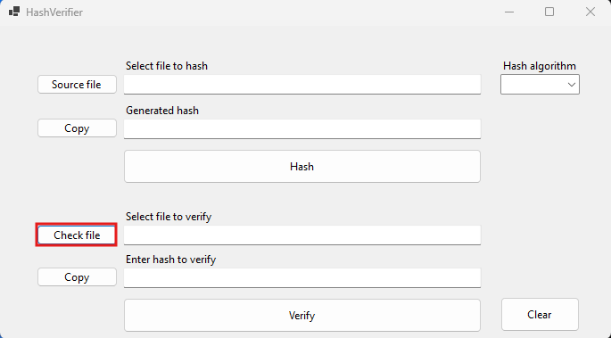
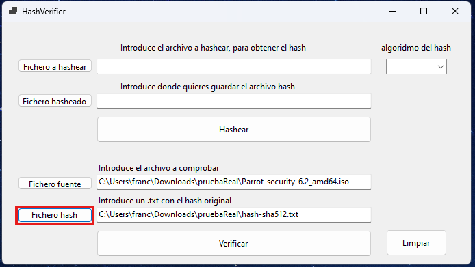
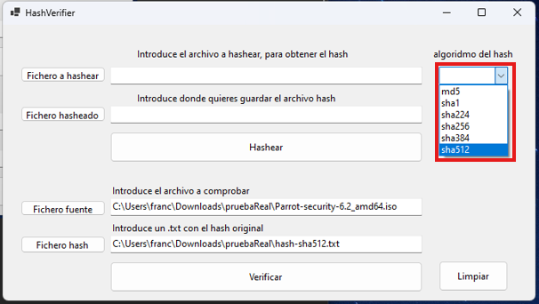

# 🛠️ HashVerifier
HashVerifier es una aplicación de Windows Forms en C# que permite calcular y verificar hashes de archivos utilizando varios algoritmos de hash, con una interfaz intuitiva y funcional. Es ideal para verificar la integridad de archivos y asegurarse de que no han sido alterados.



## 🚀 Descripción
HashVerifier permite calcular y verificar hashes de archivos utilizando varios algoritmos: **MD5, SHA-1, SHA-224, SHA-256, SHA-384** y **SHA-512**.

## ✨ Características
- 📂 Selección de archivo para calcular su hash.
- 🔍 Selección del algoritmo de hash.
- 💾 Guardar el hash calculado en un archivo.
- ✅ Verificar si el hash calculado coincide con un hash dado.
- 👤 Interfaz gráfica de usuario simple y fácil de usar.

## 🖥️ Requisitos
- .NET Framework 4.7.2 o superior

## ⚙️ Instalación
1. Clona el repositorio:
   ```bash
   git clone https://github.com/QUIENTRAEHIEL0/HashVerifier.git
   ```
3. Navega al directorio del proyecto: `cd HashVerifier`

### Compilación en Visual Studio
1. Abre el archivo del proyecto (`HashVerifier.sln`) en Visual Studio.
2. Compila la aplicación seleccionando **Build > Build Solution**.
3. Ejecuta la aplicación desde el entorno de Visual Studio o mediante el archivo `.exe` generado en la carpeta `bin`.

### Compilación desde la línea de comandos (usando .NET CLI)
1. Asegúrate de tener .NET SDK instalado. Puedes verificarlo con: `dotnet --version`
2. En el directorio del proyecto, compila la aplicación con el siguiente comando: `dotnet build`
3. Para ejecutar la aplicación después de compilarla, usa: `dotnet run --project HashVerifier`
   O, si prefieres ejecutarla desde el archivo compilado, navega a la carpeta `bin/Debug/net472` (o `Release` si usaste la opción de compilación de release) y ejecuta el archivo `.exe` correspondiente.

### 📋 Calcular un hash 
1. Selecciona el archivo que deseas hashear utilizando el botón **"Fichero a hashear"**.

   

2. Indica la ruta donde quieres guardar el hash utiliza el botón **"Fichero hasheado"**.

   

3. Selecciona el algoritmo de hash en el menú desplegable **"algoritmo del hash"**.
   
   
   
4. Haz clic en **"Hashear"** para calcular el hash del archivo seleccionado.

   

5. El hash calculado se guarda en la ruta selecionada 

### 📋 Verificar un hash
  
1. Para verificar un hash, selecciona el fichero fuente (El fichero que desea calcualar el hash) **"Fichero fuente"**.

    

2. Para verificar el hash, debes guardar el hash real en un fichero.txt he indicarlo utilizando el botón **"Fichero hash"**.

    

3. Selecciona el algoritmo de hash en el menú desplegable **"algoritmo del hash"**.
   
   

4. Para terminar la verificacion debes darle a **"Verificar"** y te mostrara el resultado en una ventana emergente.

   

## 🤝 Contribuir
Las contribuciones son bienvenidas. Si deseas contribuir, sigue estos pasos:
1. Haz un fork del repositorio.
2. Crea una nueva rama (`git checkout -b feature/nueva-feature`).
3. Realiza los cambios necesarios y haz commit (`git commit -am 'Añadir nueva feature'`).
4. Haz push a la rama (`git push origin feature/nueva-feature`).
5. Abre un Pull Request.

---

**Developed with ❤️ by [Francisco](https://github.com/Farlopitec)**
